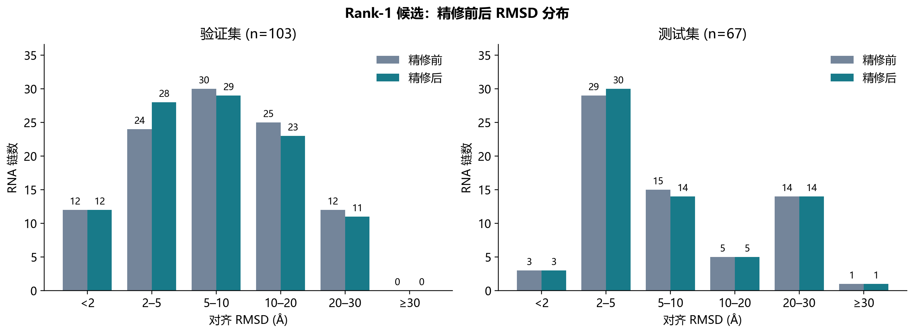
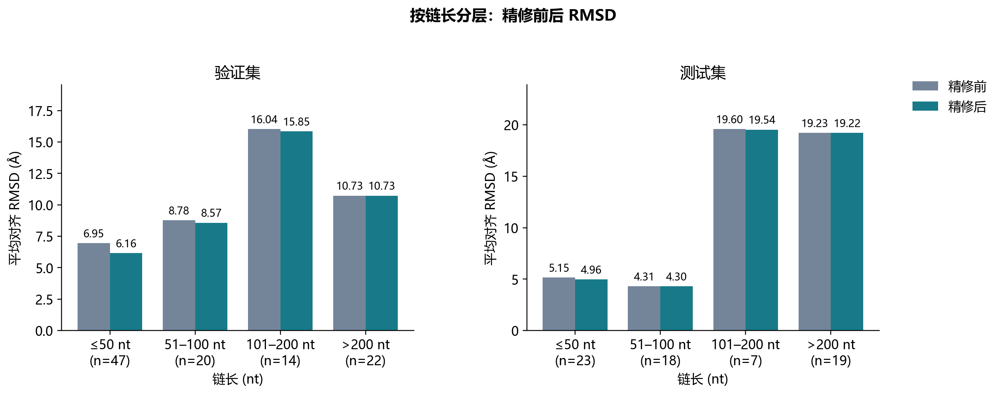
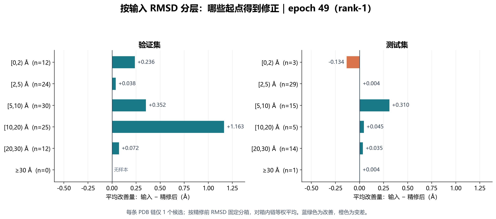
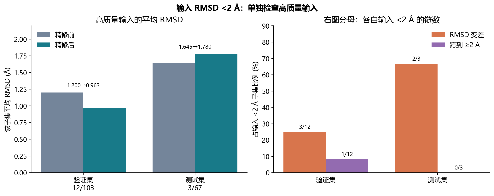

# RNA V3 模型评估结果分析：每个 PDB 只取 Protenix 排名第 1 的候选

> 汇报版本：2026-10-08。权重固定为 `epoch=49-step=157550.ckpt`；验证集和测试集均使用 `Data_PT_V2_rank1` 中每个 PDB 仅 1 个 `.pt` 的结果。本文不混入 `last-v1`，也不把本项目 RMSD 当作 FoldBench 分数。

## 一页结论

1. **按实际使用方式评估后，模型在验证集有改善，在测试集的平均收益很小。**103 条验证链平均 RMSD 为 **9.350 → 8.921 Å**，平均改善 **0.430 Å**；67 条测试链为 **10.427 → 10.351 Å**，平均改善 **0.076 Å**。测试集链级 bootstrap 95% 区间为 **−0.011～0.164 Å**，跨过 0；中位改善只有 **0.0033 Å**。
2. **测试集均值高度依赖少数短链。**改善最大的 5 条测试链贡献改善量总和的 **97.8%**；其余 62 条链平均只改善 **0.0018 Å**。≤50 nt 的 23 条测试链平均改善 0.191 Å；>200 nt 的 19 条只改善 0.012 Å。
3. **高质量输入仍有回退。**测试集输入 RMSD <2 Å 的仅 **3/67 条（4.5%）**，平均由 **1.645 升至 1.780 Å**；其中 2 条变差，1 条几乎不动。验证集这一子集为 **12/103 条（11.7%）**，平均由 1.200 降至 0.963 Å，但也有 1 条跨过 2 Å。
4. **局部几何问题比全局 RMSD 改善更一致。**测试集键长、原子冲突、碱基平面损失分别从 **0.004218、0.000996、0.00000457 Ų** 升至 **0.080261、0.026606、0.009806 Ų**；对应 **66/67、62/67、67/67** 条链变差。不能仅凭 RMSD 小幅下降认定精修结构整体更好。

**汇报用判断：**固定 epoch 49、每个 PDB 只选择原始 Protenix `ranking_score` 最高的输入时，模型对部分短链有明显修正，但测试集典型链几乎不变，而且局部几何普遍恶化。下一步应优先处理局部几何约束和高质量输入保护，再用相同选择规则复评。

## 1. 评估设计与口径

| 项目 | 本次设置 |
| --- | --- |
| 输入选择 | 在每个 split/PDB 现有 `.pt` 候选中，按**原始 Protenix `ranking_score`** 取最高的 1 个；同分时取较小 seed、再取较小 sample |
| 候选覆盖 | 原始验证集 19,722 个候选、103 个 PDB；测试集 12,310 个候选、67 个 PDB。完整 50 seed × 4 sample 的分别为 97、55 个 PDB；不足 200 个的 6、12 个 PDB 仍从**现有候选**中取最高分 |
| 实际评估 | 验证集 103 个 `.pt`、103 条链；测试集 67 个 `.pt`、67 条链。每链仅 1 个候选，因此候选均值与 PDB 链宏平均数值相同 |
| 模型 | V3 residual mobility，`epoch=49-step=157550.ckpt`；每个候选 `num_timesteps=1`，启用 `--physics` |
| 权重选择 | epoch 49 沿用先前**全候选验证集**的选模结果；本次 rank-1 测试集不参与选权重 |
| 主指标 | 在 native 可观测原子上，逐结构作适当旋转的 Kabsch 对齐 RMSD，单位 Å；并非未经对齐的坐标误差 |
| 改善量 | 输入 RMSD − 精修后 RMSD；正值代表更接近 native，负值代表变差 |
| 分层方法 | 链长与 RMSD 分层均按**精修前**固定；输出不会因为跨箱而被重新归类到另一个输入组 |

这里的“rank-1”是 **Protenix 输入模型的置信度排名第一**，并不是根据 native RMSD 挑出的“真值最优”候选。少于 200 个候选的 PDB 也只是在可用集合中选第一，不能称作完整 50×4 排名第一。本次输入选择不需要 native 结构，但 RMSD 评估需要 native 结构。

## 2. 总体 RMSD：验证集与测试集

| 数据集 | 链数 | 平均输入 → 精修后 (Å) | 平均改善 (Å) | 中位改善 (Å) | 改善 / 变差链数 | 平均改善的 95% bootstrap CI (Å) |
| --- | ---: | ---: | ---: | ---: | ---: | ---: |
| 验证集 | 103 | 9.3504 → 8.9207 | +0.4297 | +0.0537 | 69 / 34 | [0.1959, 0.7347] |
| 测试集 | 67 | 10.4270 → 10.3510 | +0.0760 | +0.0033 | 40 / 26；另 1 条近似不变 | [−0.0108, 0.1639] |

测试集有 **40/67（59.7%）** 条链在方向上改善，但大部分改善很小。表中的区间来自评估输出的链级 bootstrap；测试集区间跨过 0，因此只表述为“观察到小幅平均改善”，不据此断言总体稳定为正。链之间若存在同源关系，该区间还可能低估泛化不确定性。

| 数据集 | 改善 ≥0.1 Å | 改善 ≥0.5 Å | 变差 ≥0.1 Å | 变差 ≥0.5 Å |
| --- | ---: | ---: | ---: | ---: |
| 验证集 | 45/103 | 23/103 | 7/103 | 3/103 |
| 测试集 | 20/67 | 5/67 | 12/67 | 1/67 |

例如测试集虽然有 40 条链改善，达到 **0.1 Å** 的只有 20 条；“改善比例”需要和改善幅度一起报告。

### 与先前全候选报告的关系

| 评估输入口径 | 验证集平均输入 → 输出 (Å) | 测试集平均输入 → 输出 (Å) |
| --- | ---: | ---: |
| 每链所有可用候选，链级宏平均 | 8.9739 → 8.5599 | 10.4918 → 10.4172 |
| 每链仅 Protenix rank-1 候选，本报告 | 9.3504 → 8.9207 | 10.4270 → 10.3510 |

两行使用相同的 103/67 条目标链和 epoch 49，但**输入结构的选择不同**：第一行先平均同一链的多个候选，第二行直接评估被选中的一个候选。两行差值反映评估输入口径变化，不能解释为模型重新训练后的提升或下降。

## 3. 输入与输出 RMSD 分布

下表将精修前、后**分别按各自 RMSD** 分箱。数量是净分布；跨箱的逐样本去向见下文。

| 数据集 | RMSD 分箱 (Å) | 精修前 | 精修后 |
| --- | --- | ---: | ---: |
| 验证集 | [0,2) | 12（11.7%） | 12（11.7%） |
| 验证集 | [2,5) | 24（23.3%） | 28（27.2%） |
| 验证集 | [5,10) | 30（29.1%） | 29（28.2%） |
| 验证集 | [10,20) | 25（24.3%） | 23（22.3%） |
| 验证集 | [20,30) | 12（11.7%） | 11（10.7%） |
| 验证集 | ≥30 | 0 | 0 |
| 测试集 | [0,2) | 3（4.5%） | 3（4.5%） |
| 测试集 | [2,5) | 29（43.3%） | 30（44.8%） |
| 测试集 | [5,10) | 15（22.4%） | 14（20.9%） |
| 测试集 | [10,20) | 5（7.5%） | 5（7.5%） |
| 测试集 | [20,30) | 14（20.9%） | 14（20.9%） |
| 测试集 | ≥30 | 1（1.5%） | 1（1.5%） |

验证集有更多结构进入 2–5 Å 箱，测试集只有 1 条从 5–10 Å 进入 2–5 Å。验证集 <2 Å 的数量前后都为 12，**不代表原来的 12 条完全保留**：1 条从 <2 Å 跨到 [2,5) Å，同时 1 条从 [10,20) Å 降到 <2 Å。测试集 <2 Å 的 3 条没有跨箱，但其中 2 条在原箱内变差。

## 4. 按链长分层：精修前后 RMSD

| 数据集 | 链长 | 链数 | 输入 (Å) | 精修后 (Å) | 平均改善 (Å) | 改善比例 |
| --- | --- | ---: | ---: | ---: | ---: | ---: |
| 验证集 | ≤50 nt | 47 | 6.9535 | 6.1582 | +0.7953 | 72.3% |
| 验证集 | 51–100 nt | 20 | 8.7798 | 8.5700 | +0.2098 | 70.0% |
| 验证集 | 101–200 nt | 14 | 16.0364 | 15.8457 | +0.1907 | 71.4% |
| 验证集 | >200 nt | 22 | 10.7349 | 10.7345 | +0.0004 | 50.0% |
| 测试集 | ≤50 nt | 23 | 5.1532 | 4.9622 | +0.1910 | 73.9% |
| 测试集 | 51–100 nt | 18 | 4.3058 | 4.3025 | +0.0033 | 44.4% |
| 测试集 | 101–200 nt | 7 | 19.5980 | 19.5385 | +0.0595 | 57.1% |
| 测试集 | >200 nt | 19 | 19.2313 | 19.2196 | +0.0117 | 57.9% |

改善主要来自短链；验证集 >200 nt 的平均改善只有 **0.0004 Å**，测试集也只有 **0.0117 Å**。长链的胜率即使略高于 50%，其位移仍接近零。101–200 nt 的测试集仅 7 条，分层估计不宜作强结论。

## 5. 按输入 RMSD 分层：哪些起点得到修正

下图横轴为“输入 RMSD − 输出 RMSD”：向右是改善，向左是变差。分箱始终依据输入 RMSD；图下表保留前后两个绝对 RMSD 值。

| 数据集 | 输入 RMSD 箱 (Å) | 链数 | 输入 (Å) | 精修后 (Å) | 平均改善 (Å) | 改善比例 |
| --- | --- | ---: | ---: | ---: | ---: | ---: |
| 验证集 | [0,2) | 12 | 1.1996 | 0.9632 | +0.2364 | 75.0% |
| 验证集 | [2,5) | 24 | 3.5420 | 3.5036 | +0.0384 | 45.8% |
| 验证集 | [5,10) | 30 | 7.3055 | 6.9535 | +0.3519 | 73.3% |
| 验证集 | [10,20) | 25 | 14.3717 | 13.2087 | +1.1630 | 68.0% |
| 验证集 | [20,30) | 12 | 23.7689 | 23.6970 | +0.0719 | 83.3% |
| 测试集 | [0,2) | 3 | 1.6455 | 1.7798 | **−0.1343** | 0% |
| 测试集 | [2,5) | 29 | 3.6221 | 3.6178 | +0.0042 | 48.3% |
| 测试集 | [5,10) | 15 | 6.9395 | 6.6294 | +0.3101 | 80.0% |
| 测试集 | [10,20) | 5 | 15.5245 | 15.4798 | +0.0447 | 60.0% |
| 测试集 | [20,30) | 14 | 26.0895 | 26.0544 | +0.0351 | 71.4% |
| 测试集 | ≥30 | 1 | 41.6628 | 41.6590 | +0.0038 | 100% |

**可讲的规律：**测试集的 5–10 Å 组平均改善约 0.31 Å，是相对清楚的受益区间；<2 Å 组反而平均回退。≥20 Å 组虽多为正向，但绝对改善只有百分之几 Å。验证集 10–20 Å 组平均改善 1.163 Å，不能直接外推到只有 5 条样本、平均改善 0.045 Å 的对应测试组。

## 6. 输入 RMSD <2 Å：单独检查高质量输入

比例分母分别为验证集 103 条链、测试集 67 条链。这里每链只有 1 个候选，因而“链级”和“候选级”的低 RMSD 子集完全一致。

**右图读法：**先挑出输入 RMSD <2 Å 的链，橙色表示其中精修后 RMSD 变大的比例，紫色表示精修后达到 ≥2 Å 的比例；分母分别为 12 和 3，**不是**全部验证链和测试链。

| 数据集 | 子集数量 / 全集比例 | 输入 → 精修后均值 (Å) | 平均改善 (Å) | 变差 | 变差 ≥0.5 Å | 跨到 ≥2 Å |
| --- | ---: | ---: | ---: | ---: | ---: | ---: |
| 验证集 | 12/103，11.7% | 1.1996 → 0.9632 | +0.2364 | 3/12，25.0% | 1/12 | 1/12 |
| 测试集 | 3/67，4.5% | 1.6455 → 1.7798 | −0.1343 | 2/3，66.7% | 0/3 | 0/3 |

测试集这 3 条链逐项为：

| PDB 链 | 输入 (Å) | 精修后 (Å) | 改善 (Å) | 观察 |
| --- | ---: | ---: | ---: | --- |
| 23JZ A | 1.3739 | 1.5890 | −0.2151 | 变差，仍低于 2 Å |
| 8VT5 A | 1.7905 | 1.9782 | −0.1877 | 变差，接近 2 Å |
| 9C6J A | 1.7721 | 1.7721 | 约 0 | 基本没有移动 |

验证集也存在反例：`7POF A` 由 **1.7288 → 2.3995 Å**，变差 **0.6707 Å**，并跨过 2 Å。测试集样本只有 3 条，不能仅凭这一子集估计稳定的总体风险率；但这些具体回退已经足以说明高质量输入保护需要单独检查。

## 7. 物理结构指标：RMSD 改善的代价

以下使用模型训练代码对应的**未加权**键长、非键合冲突、碱基平面损失；全部按预测结构中的相关原子计算，单位均为 Ų，越低越好。这些是 loss 值，**不是**“坏键数”“原子碰撞个数”或完整的 RNA 化学有效性评分。

| 数据集 | 几何损失 | 输入 (Ų) | 精修后 (Ų) | 变差链数 / 比例 |
| --- | --- | ---: | ---: | ---: |
| 验证集 | 键长 | 0.018911 | 0.116931 | 99/103，96.1% |
| 验证集 | 非键合冲突 | 0.000698 | 0.033575 | 92/103，89.3% |
| 验证集 | 碱基平面 | 0.00000476 | 0.015238 | 103/103，100% |
| 测试集 | 键长 | 0.004218 | 0.080261 | 66/67，98.5% |
| 测试集 | 非键合冲突 | 0.000996 | 0.026606 | 62/67，92.5% |
| 测试集 | 碱基平面 | 0.00000457 | 0.009806 | 67/67，100% |

这种升高并非个别异常结构单独造成：测试集几乎所有链的键长和平面损失都升高。尤其需要关注第 6 节的高质量输入：

| 数据集：输入 <2 Å | 键长损失输入 → 输出 (Ų) | 冲突损失输入 → 输出 (Ų) | 平面损失输入 → 输出 (Ų) |
| --- | ---: | ---: | ---: |
| 验证集，12 条 | 0.000159 → 0.015906 | 0.0000586 → 0.003722 | 0.00000678 → 0.002927 |
| 测试集，3 条 | 0.000123 → 0.035165 | 0.0000574 → 0.004312 | 0.00000514 → 0.005964 |

这三项损失提示局部几何退化，但还不能穷尽键角、糖环、手性等几何问题。若要判断输出结构是否可直接用于下游分析，应再用独立的结构验证工具复核。

## 8. 哪些样本驱动了平均值

测试集前 5 条受益链的改善量合计占全体 67 条链改善量**净和**的约 **97.8%**；移去这 5 条之后，余下 62 条平均仅改善 **0.0018 Å**。这是描述性敏感性分析，不用于重新选择模型。

| 测试集 PDB 链 | 长度 (nt) | 输入 (Å) | 精修后 (Å) | 改善 (Å) |
| --- | ---: | ---: | ---: | ---: |
| 9IOS A | 19 | 6.4937 | 4.9927 | +1.5010 |
| 8ZNQ A | 30 | 4.3486 | 3.4056 | +0.9430 |
| 9EOW A | 29 | 4.8317 | 3.9542 | +0.8775 |
| 9FO9 A | 33 | 6.7472 | 5.8805 | +0.8666 |
| 9FO8 A | 29 | 5.7927 | 5.0043 | +0.7884 |
| 8JHP A | 27 | 3.2507 | 4.6363 | **−1.3856** |
| 8Q6N A | 46 | 2.2058 | 2.5898 | −0.3840 |

验证集平均值也受少数样本影响：`7EFG A` 改善 **10.8729 Å**、`7EFH A` 改善 **7.0519 Å**、`7EDN A` 改善 **6.4596 Å**。验证集改善最大的 5 条链占净改善总和的 **62.1%**；去掉这 5 条后，剩余 98 条平均改善 **0.1712 Å**。因此平均值之外，必须同时展示中位数与实际改善阈值。

## 9. 数据边界与汇报措辞

- **选择规则的适用范围：**只有 97/103 条验证链、55/67 条测试链具有完整 200 个候选；其余分别为 6、12 条，是在可用 `.pt` 中选最高分，且每个目标的候选数可能不同。本报告没有剔除这些不完整目标。
- **rank-1 并不意味着 native RMSD 最好。**Protenix `ranking_score` 不是精修后的 RMSD，也不是这里的物理损失；本结果是“先按模型置信度选输入，再做 refinement”的具体流程表现。
- **与旧报告的分布差异属于输入选择差异。**相同目标集合、相同 checkpoint，但旧报告取每条链的候选均值；本报告取每条链的单个最高分候选。不要把两套均值差称为模型性能的独立提升。
- **样本与泛化：**测试集仅 67 条目标链，高质量输入只有 3 条；若链之间同源，链级 bootstrap 区间不能保证序列家族独立。验证集和测试集分层差异也提醒不能把验证集较大的改善量直接外推。
- **FoldBench 口径：**测试集与 9 个 FoldBench RNA 单体目标重叠。本目录的 `foldbench_overlap.tsv` 只给出本项目的 RMSD；此前对相同候选另行运行的 FoldBench RMSD 和 lDDT 见[9 目标前后对照](FoldBench_9目标前后对照.md)。两种 RMSD 的绝对值不能直接比较，且 FoldBench 输出结构来自单独的导出运行。
- **几何指标边界：**第 7 节是模型内定义的三项损失，不能替代独立的结构质量审查。

## 10. PPT 可直接使用的 5 页叙事

1. **任务与输入规则：**每个 PDB 从现有 50×4 Protenix 预测中按原始 `ranking_score` 取 1 个，固定 epoch 49 精修；103 条验证链、67 条测试链。
2. **总体结果：**验证集 **9.350 → 8.921 Å**，测试集 **10.427 → 10.351 Å**；测试集 CI 跨 0、中位改善只有 **0.0033 Å**。可用第 3 节分布图说明整体分布位移有限。
3. **受益范围：**用第 4、5 节两图说明改善集中在短链和中等输入误差；测试集受益最大的 5 条链贡献净改善量的 **97.8%**。
4. **高质量输入风险：**用第 6 节图说明测试集输入 <2 Å 的 3 条链中有 2 条变差，验证集有 1 条跨到 ≥2 Å。
5. **结构质量与下一步：**三项物理损失普遍升高；后续优先加入对局部几何和高质量输入的约束，并以同一 rank-1 规则复评，再单独计算 FoldBench 分数。

### 约 1 分钟口头汇报稿

> 这次我按实际选模型的流程，针对每个 PDB 只保留 Protenix 原始排名最高的一个预测，再用固定的 epoch 49 权重做 RNA 精修。验证集 103 条链的平均 RMSD 从 9.350 降到 8.921 Å，平均改善 0.430 Å；测试集 67 条链则只从 10.427 降到 10.351 Å，平均改善 0.076 Å，中位改善只有 0.0033 Å。测试集的主要收益由 5 条短链贡献，其余 62 条几乎没有平均改善。输入已经低于 2 Å 的 3 条测试链里，有 2 条被拉差。更关键的是，键长、冲突和碱基平面损失在精修后普遍升高。所以目前模型能修正一部分结构，但还不能只凭 RMSD 下降说整体结构质量变好；下一步要重点解决局部几何和高质量输入保护。

## 数据来源与复核

- 原始评估：[验证集 summary](val_final/summary.json)、[测试集 summary](test_locked/summary.json)、[验证集逐链结果](val_final/samples.tsv)、[测试集逐链结果](test_locked/samples.tsv)。
- 分层及物理指标：[分析总表](analysis/analysis.md)、[RMSD 比较](analysis/rmsd_comparison.tsv)、[物理损失比较](analysis/physical_comparison.tsv)、[前后分布](analysis/rmsd_histogram.tsv)、[跨箱去向](analysis/rmsd_transitions.tsv)、[低 RMSD 链](analysis/low_input_rmsd_chains.tsv)。
- rank-1 选择清单的服务器端 SHA-256 记录：[rank1_selection.sha256](rank1_selection.sha256)。本地报告使用下载后的评估结果，选择清单本体未包含在本评估目录中。
- 图由 [`scripts/plot_rank1_epoch49_report.py`](../../scripts/plot_rank1_epoch49_report.py) 从本目录 TSV 重新生成；该脚本也复核了改善阈值、最优/最差样本和前 5 条链的贡献。与先前全候选口径的对照数字来自[旧版结果分析](../结果分析.md)。
