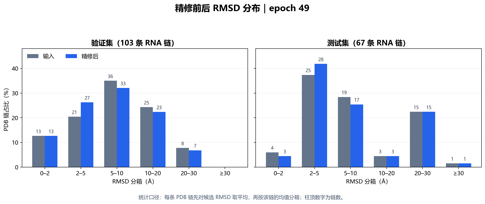
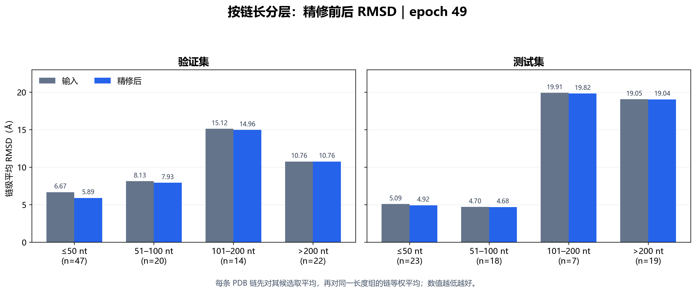
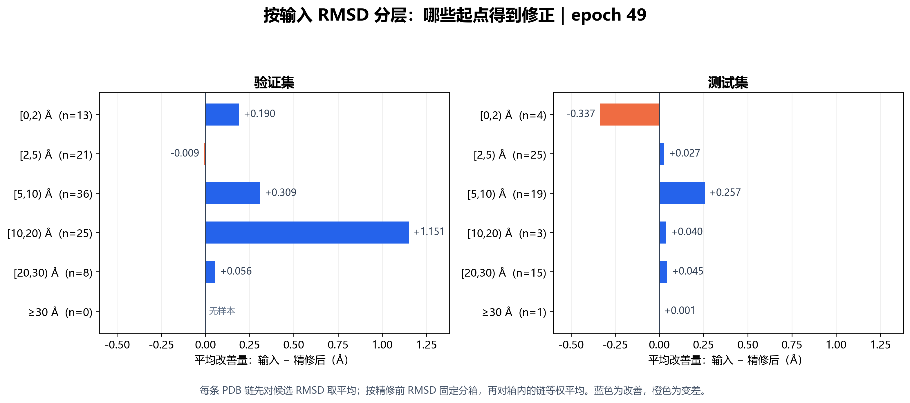
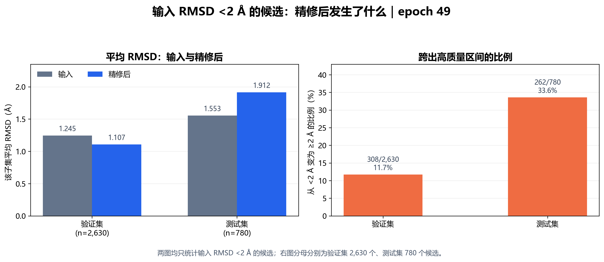

# RNA V3 residual mobility 模型评估结果分析

> 汇报版本：2026-10-08。比较 `epoch=49-step=157550.ckpt`（下称 **epoch 49**）与 `last-v1.ckpt`（下称 **last-v1**）。本报告使用已下载到本地的完整验证集、测试集结果；暂不评价 FoldBench。

## 一页结论

1. **epoch 49 是按验证集预先选出的权重。**在 103 条验证链上，平均 RMSD 从 8.974 降到 8.560 Å，平均改善 **0.414 Å**；last-v1 为 8.974 → 8.582 Å，改善 **0.392 Å**。
2. **测试集的总体改善很小。**在 67 条测试链上，epoch 49 为 10.492 → 10.417 Å，平均改善 **0.075 Å**，中位改善仅 **0.0067 Å**；last-v1 为 10.492 → 10.432 Å，平均改善 **0.060 Å**。epoch 49 比 last-v1 的测试集平均 RMSD 低 0.0148 Å；按链配对 bootstrap 的 95% 区间为 −0.0078～0.0409 Å，不能据此断言两者在测试集有稳定差异。
3. **改善主要出现在短链或较差的输入上。**epoch 49 在测试集 ≤50 nt 的 23 条链平均改善 0.167 Å；>200 nt 的 19 条链只改善 0.008 Å。测试集最受益的 5 条链贡献了链级改善总和的约 80%，其余 62 条链的平均改善只有 0.016 Å。
4. **接近 native 的输入存在明显回退。**测试集中，输入 RMSD <2 Å 的 4/67 条链（6.0%）经 epoch 49 后平均由 1.588 升至 1.925 Å，即平均变差 0.337 Å；last-v1 升至 1.979 Å，即变差 0.391 Å。候选层面分别有 262/780 与 385/780 个从 <2 Å 跨到 ≥2 Å。
5. **RMSD 与局部几何质量呈现权衡。**使用训练代码相同定义计算的键长、非键合冲突和碱基平面损失，在精修后都明显升高。以 epoch 49 测试集链级平均为例，键长损失为 0.00249 → 0.09023 Ų；67/67 条链的键长和平面损失都升高。当前不能只凭 RMSD 下降宣称结构质量整体提高。

**适合汇报的总判断：**V3 模型在部分短链和中等误差输入上具有修正能力，但留出测试集上的典型改善幅度很小；对于高质量输入和局部几何结构，仍需更可靠的保护与约束。

## 1. 评估设计与口径

| 项目 | 设置 |
| --- | --- |
| 模型与推理 | V3 residual mobility；每个输入候选进行一次 refinement，`num_timesteps=1` |
| 权重选择 | 在验证集比较 7 个 checkpoint，以 **PDB-chain 宏平均 refined RMSD 最低**选择 epoch 49；last-v1 是另行查看的对照权重 |
| 验证集 | 103 条 PDB RNA 链，19,722 个候选 |
| 测试集 | 67 条 PDB RNA 链，12,310 个候选 |
| RMSD | 仅在 native 可观测原子上，逐候选进行适当旋转的 Kabsch 对齐；单位 Å |
| 改善量 | 输入 RMSD − 精修后 RMSD；正值表示更接近 native |
| 主统计单位 | 先对同一 PDB 链的候选取均值，再对链等权平均；候选级结果用于描述输入分布与稳定性 |
| 分层 | 长度和输入 RMSD 均按精修前的值固定，避免输出跨组造成口径变化 |

两套权重的验证集和测试集候选 ID、PDB 链及输入 RMSD 已逐项核对一致，可以做配对比较。同一链的约 200 个 Protenix 候选相互相关，**不能把 19,722 或 12,310 个候选当成同样数量的独立 RNA 结构**。本文置信区间以链为重采样单位；若链之间也有同源关系，实际不确定性可能更大。

## 2. 总体 RMSD：验证集与测试集

### 2.1 主结果：每条 PDB 链等权

| 数据集 | 权重 | 链数 | 输入 → 精修后 RMSD (Å) | 平均改善 (Å) | 中位改善 (Å) | 改善链数 / 比例 | 平均改善的 95% CI (Å) |
| --- | --- | ---: | ---: | ---: | ---: | ---: | ---: |
| 验证集 | epoch 49 | 103 | 8.9739 → 8.5599 | +0.4140 | +0.0841 | 77/103，74.8% | [0.1785, 0.7254] |
| 验证集 | last-v1 | 103 | 8.9739 → 8.5815 | +0.3924 | +0.0753 | 76/103，73.8% | [0.1543, 0.7114] |
| 测试集 | epoch 49 | 67 | 10.4918 → 10.4172 | +0.0747 | +0.0067 | 46/67，68.7% | [−0.0039, 0.1507] |
| 测试集 | last-v1 | 67 | 10.4918 → 10.4320 | +0.0599 | +0.0072 | 44/67，65.7% | [−0.0242, 0.1445] |

验证集正向结果比测试集明显。两套权重的测试集平均改善区间均跨过 0；因此表述应为“观察到小幅平均改善”，不宜说“已经证明具有稳定的测试集平均改善”。epoch 49 在测试集的优势也很小：与 last-v1 相比，67 条链中有 35 条的 refined RMSD 更低、32 条更高，配对平均差 0.0148 Å。

### 2.2 补充结果：按候选等权

| 数据集 | 权重 | 候选数 | 输入 → 精修后平均 RMSD (Å) | 平均改善 (Å) | 改善候选比例 |
| --- | --- | ---: | ---: | ---: | ---: |
| 验证集 | epoch 49 | 19,722 | 8.1844 → 7.7522 | +0.4322 | 68.9% |
| 验证集 | last-v1 | 19,722 | 8.1844 → 7.7749 | +0.4095 | 68.0% |
| 测试集 | epoch 49 | 12,310 | 9.0532 → 8.9726 | +0.0806 | 65.8% |
| 测试集 | last-v1 | 12,310 | 9.0532 → 8.9891 | +0.0641 | 60.5% |

候选级均值与链级均值不同，因为部分链只有少量候选；用于判断泛化表现时，应优先看上面的链级结果。

### 2.3 改善的幅度，而不只是改善方向

| 数据集 | 权重 | 改善 ≥0.1 Å | 改善 ≥0.5 Å | 变差 ≥0.1 Å | 变差 ≥0.5 Å |
| --- | --- | ---: | ---: | ---: | ---: |
| 验证集 | epoch 49 | 49/103 | 20/103 | 11/103 | 3/103 |
| 验证集 | last-v1 | 46/103 | 17/103 | 14/103 | 5/103 |
| 测试集 | epoch 49 | 21/67 | 7/67 | 10/67 | 2/67 |
| 测试集 | last-v1 | 21/67 | 7/67 | 11/67 | 5/67 |

这些数字以**链的候选平均改善量**判断阈值。epoch 49 在测试集有 46/67 条链方向上改善，但改善至少 0.1 Å 的只有 21/67 条，说明“胜率”不能替代实际改善幅度。

## 3. 输入与输出 RMSD 分布

下表按**各自的 RMSD 值**分箱：输入列表示精修前的分布，两个输出列分别表示两套权重精修后的分布。格内为数量（占该数据集同统计单位的比例）。同一箱的输入、输出总数变化是净变化，不能代替逐样本转移分析。

### 3.1 PDB 链级分布，汇报主图

| 数据集 | RMSD 箱 (Å) | 输入 | epoch 49 输出 | last-v1 输出 |
| --- | --- | ---: | ---: | ---: |
| 验证集 | [0,2) | 13 (12.6%) | 13 (12.6%) | 12 (11.7%) |
| 验证集 | [2,5) | 21 (20.4%) | 27 (26.2%) | 27 (26.2%) |
| 验证集 | [5,10) | 36 (35.0%) | 33 (32.0%) | 34 (33.0%) |
| 验证集 | [10,20) | 25 (24.3%) | 23 (22.3%) | 23 (22.3%) |
| 验证集 | [20,30) | 8 (7.8%) | 7 (6.8%) | 7 (6.8%) |
| 验证集 | ≥30 | 0 | 0 | 0 |
| 测试集 | [0,2) | 4 (6.0%) | 3 (4.5%) | 2 (3.0%) |
| 测试集 | [2,5) | 25 (37.3%) | 28 (41.8%) | 27 (40.3%) |
| 测试集 | [5,10) | 19 (28.4%) | 17 (25.4%) | 19 (28.4%) |
| 测试集 | [10,20) | 3 (4.5%) | 3 (4.5%) | 3 (4.5%) |
| 测试集 | [20,30) | 15 (22.4%) | 15 (22.4%) | 15 (22.4%) |
| 测试集 | ≥30 | 1 (1.5%) | 1 (1.5%) | 1 (1.5%) |

验证集分布整体向较低 RMSD 箱移动；测试集的移动较弱。尤其测试集 <2 Å 链从 4 条净减至 3 条或 2 条，提示高质量输入的保护不足。

### 3.2 候选级分布，用于展示 12,310 个测试候选的变化

| 数据集 | RMSD 箱 (Å) | 输入 | epoch 49 输出 | last-v1 输出 |
| --- | --- | ---: | ---: | ---: |
| 验证集 | [0,2) | 2,630 (13.3%) | 2,528 (12.8%) | 2,517 (12.8%) |
| 验证集 | [2,5) | 4,914 (24.9%) | 5,685 (28.8%) | 5,619 (28.5%) |
| 验证集 | [5,10) | 6,591 (33.4%) | 6,417 (32.5%) | 6,501 (33.0%) |
| 验证集 | [10,20) | 4,264 (21.6%) | 3,807 (19.3%) | 3,795 (19.2%) |
| 验证集 | [20,30) | 1,323 (6.7%) | 1,285 (6.5%) | 1,290 (6.5%) |
| 验证集 | ≥30 | 0 | 0 | 0 |
| 测试集 | [0,2) | 780 (6.3%) | 518 (4.2%) | 395 (3.2%) |
| 测试集 | [2,5) | 5,441 (44.2%) | 6,018 (48.9%) | 5,824 (47.3%) |
| 测试集 | [5,10) | 3,069 (24.9%) | 2,794 (22.7%) | 3,109 (25.3%) |
| 测试集 | [10,20) | 1,154 (9.4%) | 1,121 (9.1%) | 1,123 (9.1%) |
| 测试集 | [20,30) | 1,666 (13.5%) | 1,659 (13.5%) | 1,659 (13.5%) |
| 测试集 | ≥30 | 200 (1.6%) | 200 (1.6%) | 200 (1.6%) |

**分布与真实转移的区别：**例如 epoch 49 的验证集 <2 Å 链输入、输出都为 13 条，但其中有 1 条原本 <2 Å 的链被推到 ≥2 Å，同时另有 1 条链从其他箱进入 <2 Å。完整逐箱转移计数见两套结果各自的 `analysis/rmsd_transitions.tsv`。

## 4. 按链长分层：精修前后 RMSD

每行以 PDB 链等权；输入列对两套权重相同。图只展示 epoch 49 的精修前后 RMSD；具体改善量及 last-v1 对照见下表。

| 数据集 | 长度 | 链数 | 输入 RMSD (Å) | epoch 49 后 (Å) | epoch 49 改善 (Å) | last-v1 后 (Å) | last-v1 改善 (Å) |
| --- | --- | ---: | ---: | ---: | ---: | ---: | ---: |
| 验证集 | ≤50 nt | 47 | 6.6669 | 5.8931 | +0.7737 | 5.9506 | +0.7163 |
| 验证集 | 51–100 nt | 20 | 8.1320 | 7.9298 | +0.2021 | 7.9156 | +0.2164 |
| 验证集 | 101–200 nt | 14 | 15.1224 | 14.9631 | +0.1593 | 14.9500 | +0.1724 |
| 验证集 | >200 nt | 22 | 10.7552 | 10.7551 | +0.0001 | 10.7548 | +0.0004 |
| 测试集 | ≤50 nt | 23 | 5.0887 | 4.9219 | +0.1669 | 4.9460 | +0.1427 |
| 测试集 | 51–100 nt | 18 | 4.7009 | 4.6770 | +0.0239 | 4.7179 | −0.0170 |
| 测试集 | 101–200 nt | 7 | 19.9082 | 19.8240 | +0.0842 | 19.7841 | +0.1240 |
| 测试集 | >200 nt | 19 | 19.0493 | 19.0417 | +0.0076 | 19.0406 | +0.0087 |

epoch 49 在测试集 51 nt 及以上的 44 条链平均只改善 0.0265 Å，中位改善 0.0013 Å；长链即使方向为正，移动幅度也接近零。测试集 101–200 nt 仅 7 条链，不能仅凭该组较高胜率作稳定结论。

## 5. 按输入 RMSD 分层：哪些起点得到修正

以下分组依据**链的候选平均输入 RMSD**，不按精修后的值重新分组；每行均显示精修前、后的 RMSD。

下图只展示 epoch 49 的链级平均改善量：蓝色为精修后 RMSD 降低，橙色为升高；各分箱的输入和输出 RMSD 数值见下表。

| 数据集 | 输入 RMSD 箱 (Å) | 链数 | 输入 (Å) | epoch 49 后 / 改善 (Å) | last-v1 后 / 改善 (Å) |
| --- | --- | ---: | ---: | ---: | ---: |
| 验证集 | [0,2) | 13 | 1.2699 | 1.0804 / +0.1896 | 1.0927 / +0.1772 |
| 验证集 | [2,5) | 21 | 3.5464 | 3.5552 / −0.0088 | 3.5735 / −0.0271 |
| 验证集 | [5,10) | 36 | 7.2168 | 6.9074 / +0.3094 | 6.9603 / +0.2566 |
| 验证集 | [10,20) | 25 | 15.2328 | 14.0820 / +1.1508 | 14.0687 / +1.1641 |
| 验证集 | [20,30) | 8 | 24.0875 | 24.0311 / +0.0564 | 24.0449 / +0.0426 |
| 测试集 | [0,2) | 4 | 1.5878 | 1.9250 / −0.3372 | 1.9790 / −0.3912 |
| 测试集 | [2,5) | 25 | 3.6883 | 3.6614 / +0.0269 | 3.6784 / +0.0100 |
| 测试集 | [5,10) | 19 | 7.1138 | 6.8566 / +0.2573 | 6.8864 / +0.2274 |
| 测试集 | [10,20) | 3 | 16.1619 | 16.1224 / +0.0395 | 16.1278 / +0.0341 |
| 测试集 | [20,30) | 15 | 24.9996 | 24.9548 / +0.0448 | 24.9394 / +0.0602 |
| 测试集 | ≥30 | 1 | 45.7507 | 45.7500 / +0.0007 | 45.7497 / +0.0010 |

**可讲的规律：**输入 5–10 Å 的测试链在 epoch 49 后平均改善 0.257 Å；输入 <2 Å 的链反而回退；输入 ≥20 Å 的高误差链尽管胜率较高，绝对改善通常很小。验证集 10–20 Å 组的 1.151 Å 平均改善不能直接外推到测试集同组，因为测试集该组只有 3 条链，且平均改善为 0.040 Å。

## 6. 输入 RMSD <2 Å：单独检查高质量输入

这里的比例分母分别是本 split 的全部 PDB 链或全部候选。链级按候选的**平均输入 RMSD**筛选；候选级按单个候选的输入 RMSD 筛选，两者数量不必简单相除对应。

**右图的读法：**先只取输入 RMSD <2 Å 的候选，再计算其中精修后 RMSD ≥2 Å 的比例。验证集为 308/2,630（11.7%），测试集为 262/780（33.6%）。分母是各自的高质量输入子集，不是验证集或测试集的全部候选；这张图是候选级统计，链级对应值见下表。

| 数据集 | 统计单位 | 子集数量 / 比例 | 输入平均 (Å) | epoch 49 后 (Å) | epoch 49 变差比例 | last-v1 后 (Å) | last-v1 变差比例 |
| --- | --- | ---: | ---: | ---: | ---: | ---: | ---: |
| 验证集 | PDB 链 | 13/103，12.6% | 1.2699 | 1.0804 | 23.1% | 1.0927 | 23.1% |
| 验证集 | 候选 | 2,630/19,722，13.3% | 1.2448 | 1.1065 | 27.0% | 1.1185 | 28.8% |
| 测试集 | PDB 链 | 4/67，6.0% | 1.5878 | 1.9250 | 75.0% | 1.9790 | 100.0% |
| 测试集 | 候选 | 780/12,310，6.3% | 1.5531 | 1.9125 | 77.3% | 1.9666 | 99.5% |

| 数据集 | 单位 | epoch 49：由 <2 到 ≥2 Å | last-v1：由 <2 到 ≥2 Å |
| --- | --- | ---: | ---: |
| 验证集 | PDB 链 | 1/13，7.7% | 2/13，15.4% |
| 验证集 | 候选 | 308/2,630，11.7% | 318/2,630，12.1% |
| 测试集 | PDB 链 | 1/4，25.0% | 2/4，50.0% |
| 测试集 | 候选 | 262/780，33.6% | 385/780，49.4% |

测试集 4 条高质量输入链的具体变化如下。表格用同一条链的候选平均 RMSD；`9C6J` 的末位差异接近零，可视为基本未改变。

| PDB 链 | 输入 (Å) | epoch 49 后 (Å) | last-v1 后 (Å) | 主要观察 |
| --- | ---: | ---: | ---: | --- |
| 9OD4 A | 1.4889 | 2.3103 | 2.2000 | 两权重均明显拉差 |
| 23JZ A | 1.3054 | 1.6478 | 1.6128 | 两权重均拉差 |
| 8VT5 A | 1.8027 | 1.9878 | 2.3491 | last-v1 跨过 2 Å |
| 9C6J A | 1.7542 | 1.7541 | 1.7542 | 基本没有移动 |

验证集 <2 Å 子集的平均表现虽为正，但也存在反例：epoch 49 将 `7POF A` 从 1.7131 拉到 2.5023 Å，last-v1 拉到 2.6593 Å。两套权重均需要更好的 no-op / 风险控制机制。

## 7. 物理结构指标：RMSD 改善的代价

评估脚本按模型训练时的定义，对全部预测原子分别计算：键长与理想键长差的平方均值、非键合原子重叠的平方均值、碱基原子拟合平面的最小协方差特征值。下表是**每条链先对候选取均值、再对链等权**的未经 loss 权重缩放的结果，单位均为 Ų；数值越小越好。它们是几何损失，不是“冲突原子数”或独立结构验证器的分数。

| 数据集 | 几何指标 | 输入 (Ų) | epoch 49 后 (Ų) | epoch 49 变差链比例 | last-v1 后 (Ų) | last-v1 变差链比例 |
| --- | --- | ---: | ---: | ---: | ---: | ---: |
| 验证集 | 键长损失 | 0.01957 | 0.12889 | 97.1% | 0.14443 | 97.1% |
| 验证集 | 非键合冲突损失 | 0.000851 | 0.036629 | 94.2% | 0.036424 | 98.1% |
| 验证集 | 碱基平面损失 | 0.0000112 | 0.017871 | 100% | 0.019057 | 100% |
| 测试集 | 键长损失 | 0.002494 | 0.090228 | 100% | 0.110733 | 100% |
| 测试集 | 非键合冲突损失 | 0.000997 | 0.026639 | 95.5% | 0.027948 | 98.5% |
| 测试集 | 碱基平面损失 | 0.00000462 | 0.011106 | 100% | 0.012811 | 100% |

这不是单个异常链造成的现象：epoch 49 的测试集 67/67 条链在键长和平面损失上均变差，冲突损失在 64/67 条链上变差。last-v1 的对应数字为 67/67、67/67 和 66/67。**汇报时应把“更接近 native 的全局 RMSD”和“局部几何变差”放在同一页。**上线前仍需用原子碰撞、键角、糖环、手性等独立工具核验；本表只覆盖模型代码中的三项损失。

## 8. 哪些样本驱动了平均值

epoch 49 测试集改善最大的 5 条链，合计贡献链级改善总和的约 **80.0%**。将它们从 67 条链中移除后，剩余 62 条链的平均改善为 **0.0161 Å**。因此 0.0747 Å 的测试集平均值仍由少数受益样本明显拉高。

| 测试集 PDB 链 | 长度 (nt) | 输入 (Å) | epoch 49 后 (Å) | last-v1 后 (Å) | epoch 49 改善 (Å) |
| --- | ---: | ---: | ---: | ---: | ---: |
| 9FO8 A | 29 | 5.7614 | 4.8539 | 5.0536 | +0.9075 |
| 8ZNQ A | 30 | 4.2024 | 3.3165 | 3.1266 | +0.8859 |
| 9IOS A | 19 | 5.5315 | 4.7649 | 4.7280 | +0.7666 |
| 9EOW A | 29 | 4.7973 | 4.0566 | 3.9941 | +0.7407 |
| 9FO9 A | 33 | 6.3014 | 5.5993 | 5.5347 | +0.7022 |
| 8JHP A | 27 | 3.9901 | 4.9040 | 4.8629 | −0.9139 |
| 9OD4 A | 23 | 1.4889 | 2.3103 | 2.2000 | −0.8214 |
| 8Q6N A | 46 | 2.1247 | 2.5257 | 2.5622 | −0.4010 |

验证集也有长尾：`7EFG A` 在 epoch 49 下改善 10.925 Å，`7EDN A` 改善 7.191 Å，`7EFH A` 改善 7.109 Å。验证集改善最大的 5 条链贡献总改善的约 66.1%；去掉它们后，剩余 98 条的平均改善为 0.148 Å。这里仅做描述性敏感性分析，不用测试集重新挑选权重。

## 9. 数据边界与汇报措辞

- **候选覆盖不均匀。**验证集 6/103、测试集 12/67 条链不足 200 个候选；例如测试集 `9M79 A` 只有 1 个、`9LEL J` 只有 2 个。链级宏平均避免候选多的链主导总体，但这些少量候选链本身的均值不稳定。只保留 200 候选齐全的 55 条测试链时，epoch 49 的平均改善为 0.0883 Å，仍属小幅变化。
- **验证集与测试集差异明显。**epoch 49 的链级平均改善分别为 0.414 与 0.075 Å。验证集选模结果不能直接当成测试性能。
- **不能与旧报告的数值直接并排比较模型优劣。**第二次训练报告使用验证集 111 条、测试集 82 条链；本次分别为 103 条和 67 条，评估集合已经改变。如需比较 V3 与旧模型，应在同一批输入候选上重新运行两者。
- **同源性尚未在本报告中重新审计。**先前第二次训练报告指出过序列重叠与短序列过滤问题；此次使用的 `.pt` 集合与当时不同，但仅凭评估 TSV 无法证明这些风险已经完全消失。因此不要把这里的链级 bootstrap 区间解释成严格的 sequence-family 独立泛化证明。
- **测试集只作结果描述。**epoch 49 的选择已由验证集完成；last-v1 是额外的对照展示。不要依据本次测试集差异继续反复选择 checkpoint 或调推理超参数。
- **物理指标为代理量。**三项 loss 的升高是真实计算结果，但不等同于全部 RNA 化学几何检查；进一步结构质控仍是必要步骤。

## 10. PPT 可直接使用的 5 页叙事

1. **评估口径与选模：**103 条验证链用于从 7 个 checkpoint 选出 epoch 49；67 条测试链用于报告。主指标是链级宏平均 Kabsch RMSD。
2. **总体结果：**epoch 49 验证集 8.974 → 8.560 Å，测试集 10.492 → 10.417 Å；测试集中位改善仅 0.0067 Å，last-v1 与 epoch 49 的测试差异很小。
3. **分布与适用范围：**展示第 3 节分布图和第 4 节长度图。效果集中在短链、中等输入误差；>200 nt 几乎不变。
4. **失败模式：**展示第 6 节低 RMSD 子集图。测试集 <2 Å 的 4 条链平均被拉差，epoch 49 有 1 条、last-v1 有 2 条跨过 2 Å。
5. **结构质量与下一步：**第 7 节三项几何损失普遍升高。下一版重点应兼顾高质量输入保护、几何约束与长链有效移动，然后在去同源审计后的数据上重新验证。

### 约 1 分钟口头汇报稿

> 这次我们先在验证集的 103 条 RNA 链上比较 7 个权重，按链级平均 RMSD 选出了 epoch 49，并额外评估了最后保存的 last-v1。epoch 49 在验证集平均改善 0.414 Å，但到 67 条链的测试集，平均改善只有 0.075 Å，中位数只有 0.0067 Å，说明典型链的变化很小。进一步分层发现，受益主要集中在短链和输入误差中等的结构；超过 200 nt 的长链基本没有明显改善。更值得关注的是，输入已经小于 2 Å 的测试链平均被拉差，同时键长、原子冲突和碱基平面损失普遍升高。所以下一步需要先解决“何时不要动”和局部几何保持，再谈结构质量的整体提升。

## 数据来源与复核

- epoch 49：[链与候选原始结果](v3_20261008/test_locked/summary.json)、[详细分析表](v3_20261008/analysis/analysis.md)。
- last-v1：[链与候选原始结果](v3_20261008_last_v1/test_locked/summary.json)、[详细分析表](v3_20261008_last_v1/analysis/analysis.md)。
- 验证集 checkpoint 对比：[checkpoint_comparison.tsv](v3_20261008/checkpoint_comparison.tsv)。
- 本报告的分布、分层、低 RMSD 与物理损失均从两套结果中的 `analysis/*.tsv` 和 `val_final`、`test_locked` 的原始输出复核；配对权重差使用 67 条测试链、固定随机种子的 20,000 次链级 bootstrap。
