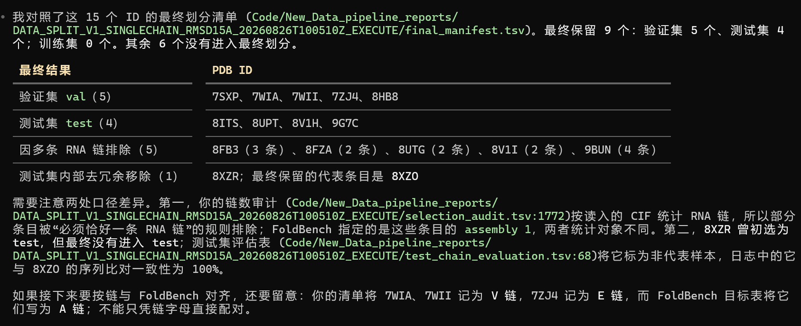

1.residual模式(**已完成**)

2.看foldbench中的RNA结构可不可以作为我的测试集(**已完成**，15个PDB\_id都包含在我的数据集中)

3.之后报告loss要用smooth曲线(**已完成**)

4.max_epoch可以调大一点，边训边报告(**已完成** 已经调成50epoch了)

5.调大缩放梯度(**已完成** 从1.0变成5.0了 gradient_clip_val: 5.0与grad_norm_max_val: 5.0两个参数)

对数据集动手:
1.再次检查测试集（去同源序列  去冗余）
2.训练集50nt以上的上采样
3.不去除ranking-score-1大于等于15A的
4.不去除大于等于30A的。同时寻找其与ranking_score的关系

待做:

1.从训练集中读取数据的不同模式:现在是完全随机 如果每次读取的48个pt文件都是一个PDB采样得到的呢(待做 可以作为消融条件)

