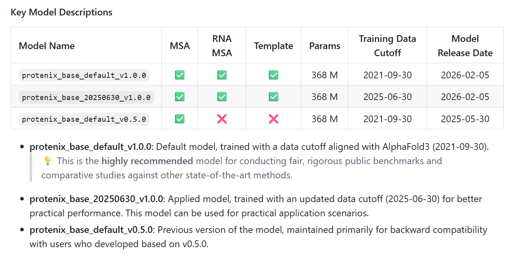
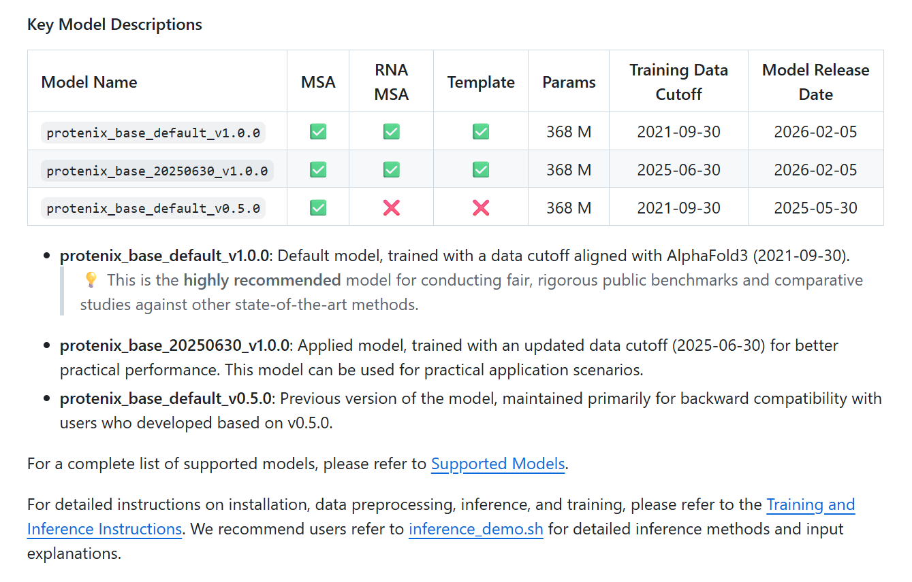

# WHAT I HAVE DONE

## 2026.2.7
1.下载清洗了包含RNA的PDB数据

## 2026.3.2
1.在实验室服务器上安装了protenix


2.protenix 参数说明
```

# Protenix Model Inference Test Script
#
# Purpose:
#   This script provides usage examples for running inference with various
#   Protenix model versions and configurations.
#
# Arguments Summary (for 'protenix pred' or 'runner/inference.py'):
#   -i, --input (str):       [Required] Input JSON file or directory.
#   -o, --out_dir (str):     [Default: ./output] Output directory for results.
#   -s, --seeds (str):       [Default: 101] Inference seeds (e.g., "101,102").
#   -c, --cycle (int):       [Default: 10] Number of Pairformer cycles.
#   -p, --step (int):        [Default: 200] Number of diffusion steps.
#   -e, --sample (int):      [Default: 5] Samples per seed.
#   -d, --dtype (str):       [Default: bf16] Inference data type (bf16, fp32).
#   -n, --model_name (str):  [Default: protenix_base_default_v1.0.0] Model name.
#                            NOTE: protenix_base_default_v1.0.0 is the RECOMMENDED default.
#   --use_msa (bool):        Whether to use protein MSA features.
#   --use_default_params:    Auto-load recommended defaults for the model.
#   --trimul_kernel (str):   Triangle multiplicative kernel ('cuequivariance', 'torch').
#   --triatt_kernel (str):   Triangle attention kernel ('triattention', 'cuequivariance', etc.).
#   --use_template (bool):   Enable template features (v1.0.0+ only).
#   --use_rna_msa (bool):    Enable RNA MSA features (v1.0.0+ only).
#   --use_seeds_in_json:     Prioritize seeds defined in the input JSON.
#
# Available Models (Ref: configs/configs_model_type.py, docs/supported_models.md):
#   * protenix_base_default_v1.0.0:    [DEFAULT] Advanced model supporting Template & RNA MSA (Training Data Cutoff: 2021-09-30).
#   1. protenix_base_20250630_v1.0.0:  Latest model for practical scenarios (Training Data Cutoff: 2025-06-30).
#   2. protenix_base_default_v0.5.0:   Standard base model (Training Data Cutoff: 2021-09-30).
#   3. protenix_base_constraint_v0.5.0: Base model with constraint support (Training Data Cutoff: 2021-09-30).
#   4. protenix_mini_esm_v0.5.0:       Lightweight ESM-only model (no MSA) (Training Data Cutoff: 2021-09-30).
#   5. protenix_mini_ism_v0.5.0:       Lightweight ISM-only model (no MSA) (Training Data Cutoff: 2021-09-30).
#   6. protenix_mini_default_v0.5.0:   Standard lightweight model (Training Data Cutoff: 2021-09-30).
#   7. protenix_tiny_default_v0.5.0:   Ultra-lightweight model (Training Data Cutoff: 2021-09-30).
# ==============================================================================

# ------------------------------------------------------------------------------
# Section 1: Running via Protenix CLI (protenix pred)
# ------------------------------------------------------------------------------

# ##############################################################################
# # !!! IMPORTANT: ENVIRONMENT SETUP !!!
# # ----------------------------------------------------------------------------
# # 1. Ensure environment variables are correctly set:
# #    - PROTENIX_ROOT_DIR: Your data root directory
# #    - CUTLASS_PATH: Path for deepspeed (e.g., /opt/cutlass/)
# #
# #    Uncomment and modify the lines below if needed:
# #    # export PROTENIX_ROOT_DIR="/modify/to/your/data_root_dir"
# #    # export CUTLASS_PATH=/opt/cutlass/
# #
# # 2. Dependency for Template & RNA MSA:
# #    If using these features, ensure 'kalign' and 'hmmer' are installed:
# #    apt-get update && apt-get install -y kalign hmmer
# # ############################################################################

echo "Starting Section 1: CLI-based inference tests..."

# Example 1.1: Standard inference with Template support (v1.0.0)
protenix pred \
    -i examples/input.json \
    -o ./test_outputs/cmd/output_base_v1 \
    -s 101 \
    -n protenix_base_default_v1.0.0 \
    --use_template true \
    --use_default_params true


# Example 1.2: Inference using seeds defined in JSON
protenix pred \
    -i examples/examples_with_template/example_mgyp004658859411.json \
    -o ./test_outputs/cmd/output_base_v1 \
    -s 101 \
    -n protenix_base_default_v1.0.0 \
    --use_template true \
    --use_seeds_in_json true \
    --use_default_params true

# Example 1.3: RNA MSA support (v1.0.0 exclusive)
protenix pred \
    -i examples/examples_with_rna_msa/example_9gmw_2.json \
    -o ./test_outputs/cmd/output_base_v1 \
    -n protenix_base_default_v1.0.0 \
    --use_rna_msa true  \
    --use_default_params true

# Example 1.4: Latest model v1.0.0 with 2025-06-30 cutoff
protenix pred \
    -i examples/input.json \
    -o ./test_outputs/cmd/output_base_v1_20250630 \
    -s 101 \
    -n protenix_base_20250630_v1.0.0 \
    -c 4 \
    -p 20 \
    --use_template true

# Example 1.5: Base model v0.5.0 with precomputed MSA
protenix pred \
    -i examples/example.json \
    -o ./test_outputs/cmd/output_base \
    -s 101 \
    -c 4 \
    -p 20 \
    -n "protenix_base_default_v0.5.0" \
    --use_default_params true

# Example 1.6: Mini model with ESM features only
protenix pred \
    -i examples/example.json \
    -o ./test_outputs/cmd/output_mini_esm \
    -s 102 \
    -n "protenix_mini_esm_v0.5.0" \
    --use_default_params true

# Example 1.7: Mini model with ISM features only
protenix pred \
    -i examples/example.json \
    -o ./test_outputs/cmd/output_mini_ism \
    -s 103 \
    -n "protenix_mini_ism_v0.5.0" \
    --use_default_params true

# Example 1.8: Base constraint model
protenix pred \
    -i examples/example_constraint_msa.json \
    -o ./test_outputs/cmd/output_constraint \
    -s 104 \
    -n "protenix_base_constraint_v0.5.0" \
    --use_default_params true

# Example 1.9: Tiny default model
protenix pred \
    -i examples/example.json \
    -o ./test_outputs/cmd/output_tiny \
    -s 106 \
    -n "protenix_tiny_default_v0.5.0" \
    --use_default_params true


# ------------------------------------------------------------------------------
# Section 2: Running via Runner Script (runner/inference.py)
#
# IMPORTANT:
#   Direct script execution requires features (MSA, templates, RNA MSA, etc.)
#   to be pre-prepared in the input JSON. This mode is optimized for GPU-only
#   computation.
#   If features are NOT ready, please use the preprocessing command first:
#   Example: protenix prep --input examples/input.json --out_dir ./output
# ------------------------------------------------------------------------------

echo "Starting Section 2: Script-based inference tests..."
export PYTHONPATH="${PYTHONPATH}:$(pwd)"

# Test 2.1: Base v1.0.0 with Template support
# Features: Template enabled, cuequivariance attention
N_sample=5
N_step=200
N_cycle=10
seed=103
input_json_path="./examples/examples_with_template/example_9fm7.json"
dump_dir="./test_outputs/sh/output_m_9fm7"
model_name="protenix_base_default_v1.0.0"

python3 runner/inference.py \
    --model_name ${model_name} \
    --seeds ${seed} \
    --dump_dir ${dump_dir} \
    --input_json_path ${input_json_path} \
    --model.N_cycle ${N_cycle} \
    --sample_diffusion.N_sample ${N_sample} \
    --sample_diffusion.N_step ${N_step} \
    --triangle_attention "cuequivariance" \
    --use_seeds_in_json true \
    --triangle_multiplicative "cuequivariance" \
    --use_template true

# Test 2.2: Latest model v1.0.0 with 2025-06-30 cutoff
N_sample=1
N_step=200
N_cycle=10
seed=101
input_json_path="./examples/input.json"
dump_dir="./test_outputs/sh/output_base_20250630"
model_name="protenix_base_20250630_v1.0.0"

python3 runner/inference.py \
    --model_name ${model_name} \
    --seeds ${seed} \
    --dump_dir ${dump_dir} \
    --input_json_path ${input_json_path} \
    --model.N_cycle ${N_cycle} \
    --sample_diffusion.N_sample ${N_sample} \
    --sample_diffusion.N_step ${N_step} \
    --triangle_attention "cuequivariance" \
    --triangle_multiplicative "cuequivariance" \
    --use_template true

# Test 2.3: Base v0.5.0 with triattention
N_sample=1
N_step=200
N_cycle=10
seed=101
input_json_path="./examples/example.json"
dump_dir="./test_outputs/sh/output_base"
model_name="protenix_base_default_v0.5.0"

python3 runner/inference.py \
    --model_name ${model_name} \
    --seeds ${seed} \
    --dump_dir ${dump_dir} \
    --input_json_path ${input_json_path} \
    --model.N_cycle ${N_cycle} \
    --sample_diffusion.N_sample ${N_sample} \
    --sample_diffusion.N_step ${N_step} \
    --triangle_attention "triattention" \
    --triangle_multiplicative "cuequivariance"

# Test 2.4: Mini ESM v0.5.0 with cuequivariance
N_sample=1
N_step=5
N_cycle=4
seed=101
input_json_path="./examples/example.json"
dump_dir="./test_outputs/sh/output_mini_esm"
model_name="protenix_mini_esm_v0.5.0"

python3 runner/inference.py \
    --model_name ${model_name} \
    --seeds ${seed} \
    --dump_dir ${dump_dir} \
    --input_json_path ${input_json_path} \
    --model.N_cycle ${N_cycle} \
    --sample_diffusion.N_sample ${N_sample} \
    --sample_diffusion.N_step ${N_step} \
    --triangle_attention "cuequivariance" \
    --triangle_multiplicative "cuequivariance"

# Test 2.5: Mini ISM v0.5.0 with deepspeed
N_sample=1
N_step=5
N_cycle=4
seed=101
input_json_path="./examples/example.json"
dump_dir="./test_outputs/sh/output_mini_ism"
model_name="protenix_mini_ism_v0.5.0"

python3 runner/inference.py \
    --model_name ${model_name} \
    --seeds ${seed} \
    --dump_dir ${dump_dir} \
    --input_json_path ${input_json_path} \
    --model.N_cycle ${N_cycle} \
    --sample_diffusion.N_sample ${N_sample} \
    --sample_diffusion.N_step ${N_step} \
    --triangle_attention "deepspeed" \
    --triangle_multiplicative "cuequivariance"

# Test 2.6: Base Constraint v0.5.0 with torch attention
N_sample=1
N_step=200
N_cycle=10
seed=101
input_json_path="./examples/example_constraint_msa.json"
dump_dir="./test_outputs/sh/output_constraint"
model_name="protenix_base_constraint_v0.5.0"

python3 runner/inference.py \
    --model_name ${model_name} \
    --seeds ${seed} \
    --dump_dir ${dump_dir} \
    --input_json_path ${input_json_path} \
    --model.N_cycle ${N_cycle} \
    --sample_diffusion.N_sample ${N_sample} \
    --sample_diffusion.N_step ${N_step} \
    --triangle_attention "torch" \
    --triangle_multiplicative "cuequivariance"

# Test 2.7: Mini Default v0.5.0 with torch attention/multiplicative
N_sample=1
N_step=5
N_cycle=4
seed=101
input_json_path="./examples/example.json"
dump_dir="./test_outputs/sh/output_mini"
model_name="protenix_mini_default_v0.5.0"

python3 runner/inference.py \
    --model_name ${model_name} \
    --seeds ${seed} \
    --dump_dir ${dump_dir} \
    --input_json_path ${input_json_path} \
    --model.N_cycle ${N_cycle} \
    --sample_diffusion.N_sample ${N_sample} \
    --sample_diffusion.N_step ${N_step} \
    --triangle_attention "torch" \
    --triangle_multiplicative "torch"

# Test 2.8: Tiny Default v0.5.0 with torch attention/multiplicative
N_sample=1
N_step=5
N_cycle=4
seed=101
input_json_path="./examples/example.json"
dump_dir="./test_outputs/sh/output_tiny"
model_name="protenix_tiny_default_v0.5.0"

python3 runner/inference.py \
    --model_name ${model_name} \
    --seeds ${seed} \
    --dump_dir ${dump_dir} \
    --input_json_path ${input_json_path} \
    --model.N_cycle ${N_cycle} \
    --sample_diffusion.N_sample ${N_sample} \
    --sample_diffusion.N_step ${N_step} \
    --triangle_attention "torch" \
    --triangle_multiplicative "torch"

echo "All inference tests completed."


# The following is a demo to use DDP for inference
# torchrun \
#     --nproc_per_node $NPROC \
#     --master_addr $WORKER_0_HOST \
#     --master_port $WORKER_0_PORT \
#     --node_rank=$ID \
#     --nnodes=$WORKER_NUM \
#     runner/inference.py \
#     --seeds ${seed} \
#     --dump_dir ${dump_dir} \
#     --input_json_path ${input_json_path} \
#     --model.N_cycle ${N_cycle} \
#     --sample_diffusion.N_sample ${N_sample} \
#     --sample_diffusion.N_step ${N_step}
```

## 2026.3.3
1.实现了PDB的RNA数据的初步分类

2.Alphafold2的数据库下载失败

## 2026.3.4
1.完整下载Alphafold2的数据库
    1.UniRef90
    2.MGnify
    3.PDB Seqres
    4.BFD 巨型库
    5.rnacentral
    6.rfam
    7.pdb_mmcif

## 2026.3.5
1.下载完成protenix的数据库并且跑通了protenix  注意:本质还是拿云端API跑的，没有用到下载到本地的数据库  

## 2026.3.6
1.理解了cif/mmcif文件

2.下载了可视化cif文件的软件Pymol

3.理清了扒取RNA数据的脚本

4.理清了分类RNA数据的脚本

## 2026.3.7
1.粗略地看了一遍protenix的论文

## 2026.3.9
1.开始尝试跑protenix

## 2026.3.16
1.先把cif文件全部变成简单的protenix输入Json文件

关于当前跑模型的选择:
1.升级显卡驱动 用原版跑
2.用网页端跑，每天限制100个 一个一个上传
3.用降级版本的跑:
要求是CUDA12
python==3.11  ↓
torch==2.5.0 ↓
torchvision==0.20.0 ↓
torchaudio==2.5.0 ↓
cuequivariance-ops-torch-cu12==0.8.0 ✔
cuequivariance-torch==0.8.0 ✔
scipy==1.13.1  ✔
ml_collections==1.1.0 ✔
tqdm==4.66.5 ↓
pandas==2.2.3 ↓
PyYAML==6.0.2 ✔
matplotlib==3.9.2 ↓
ipywidgets==8.1.5 ↓
py3Dmol==2.4.0 ↓
rdkit==2024.03.5  ↓
biopython==1.84 ↓
biotite==1.3.0 ↓
modelcif==1.4 ✔
gemmi==0.6.7 ✔
pdbeccdutils==1.0.0 ✔
fair-esm==2.0.0 ✔
scikit-learn==1.5.2 ↓
scikit-learn-extra==0.3.0 ✔
deepspeed==0.15.1 ↓
pydantic==2.9.2 ✔
triton==3.3.1
optree==0.13.0 ↓
protobuf==4.25.5 ↓
icecream==2.1.7 ✔
ipdb==0.13.13 ✔
wandb==0.18.5 ↓
numpy==1.26.4 ↓

# Q&A

1.清洗PDB数据库
2.所有的筛选出来的RNA序列扔给protenix生成结构
3.聚类，相似的放在一起 按照一定比例划分数据集 测试集 验证集  protenix生成的结构VS真实的结构，针对protenix生成的结构做refinement
4.选择流匹配pro-matching进行训练(旧模型？)


## Q1:我所使用的扒取RNA的脚本是怎样的原理？ DONE
        query = {
            "query": {
                "type": "terminal",
                "service": "text",
                "parameters": {
                    "attribute": "rcsb_entry_info.polymer_entity_count_RNA",
                    "operator": "greater",
                    "value": 0
                }
            },
            "return_type": "entry",
            "request_options": {
                "return_all_hits": True
            }
        }

        try:
            response = requests.post(
                CONFIG["rcsb_search_url"],
                json=query,
                timeout=30,
                headers={"Content-Type": "application/json"}
            )
            response.raise_for_status()
            result_set = response.json()['result_set']
            id_list = [entry['identifier'] for entry in result_set]
            print(f"从 PDB 找到 {len(id_list)} 个包含 RNA 的结构 ID。")
            return id_list


        try:
            file_path = self.pdbl.retrieve_pdb_file(
                pdb_code=pdb_id_lower,
                pdir=self.save_dir,
                file_format='mmCif',
                overwrite=False
            )

## Q2:RNA的cif的数据结构是怎样的? DONE

详细见/RNA/Data/mmcif.md

## Q3:RNA的cif包含上传日期吗？protenix的默认模型训练数据截止到2021.9.30 防止用于生成的模型记住结构 DONE
RNA的cif文件包含文件的修改日期和修改内容，换句话说，包含整个修改历史

但是先继续训练，因为RNA数据不多，用protenix跑出来的RNA应该和真实的RNA结构差距较大

## Q4:我所使用的分类RNA的脚本是怎样的原理？ 分类是否正确？ DONE
    for filename in tqdm(cif_files, desc="分类进度"):
        filepath = os.path.join(data_dir, filename)

        try:
            # 高效读取机制：只解析 CIF 字典，不构建 3D 结构树，速度快百倍
            mmcif_dict = MMCIF2Dict(filepath)

            # --- 提取并格式化所需字段 ---
            # 1. 标题 (Title)
            title = mmcif_dict.get('_struct.title', [''])[0].lower()

            # 2. 分子类型 (Polymer Types)
            poly_types = mmcif_dict.get('_entity_poly.type', [])
            if isinstance(poly_types, str): poly_types = [poly_types]
            poly_types_str = " ".join([str(t).lower() for t in poly_types])

            # 3. 分子描述 (Entity Descriptions - 用于识别 tRNA/mRNA)
            entity_desc = mmcif_dict.get('_entity.pdbx_description', [])
            if isinstance(entity_desc, str): entity_desc = [entity_desc]
            entity_desc_str = " ".join([str(d).lower() for d in entity_desc])

            # --- 逻辑判断标志位 ---
            has_rna = 'polyribonucleotide' in poly_types_str
            has_protein = 'polypeptide' in poly_types_str
            has_dna = 'polydeoxyribonucleotide' in poly_types_str

            # 核糖体关键词匹配
            ribosome_keywords = ['ribosome', 'ribosomal', '50s', '30s', '70s', '80s', '40s', '60s']
            is_ribosome = any(kw in title for kw in ribosome_keywords) or any(
                kw in entity_desc_str for kw in ribosome_keywords)

            # 结合态RNA匹配 (tRNA, mRNA, sgRNA 等)
            bound_rna_keywords = ['trna', 'mrna', 'transfer rna', 'messenger rna', 'aptamer']
            has_bound_rna = any(kw in entity_desc_str for kw in bound_rna_keywords) or any(
                kw in title for kw in bound_rna_keywords)

            # --- 分类路由逻辑 ---
            target_key = "others"

            if is_ribosome:
                if has_bound_rna:
                    target_key = "ribosome_bound"  # 包含tRNA/mRNA的核糖体
                else:
                    target_key = "ribosome"  # 纯核糖体 (rRNA + rProteins)
            elif has_protein and has_rna:
                target_key = "rna_protein"  # 普通的 RNA-蛋白质复合体
            elif has_rna and not has_protein and not has_dna:
                target_key = "pure_rna"  # 纯 RNA (且不含DNA)
            else:
                target_key = "others"  # 包含 DNA-RNA 杂交链，或解析异常的文件


## Q5:如何展示我的RNA数据  分类？ 长度 缺失率 DONE
总共扒取 分类展示 饼状图

重点展示纯RNA链中的长度(残基个数)与缺失率(长度/应该有的长度)  

## Q6:protenix的原理？模型架构 论文看一看 DONE
粗略地看了一遍

详细见protenix.md
## Q7:目前protenix已经安装 还差alphafold的数据库？ DONE

alphafold的数据库已经安装  并且跑通了protenix  


## Q8:模型选择哪个？
参考流匹配 flow-matching 发的论文是用流匹配做抗体的 但是没有代码  去其他地方偷一个比较标准的代码


## Q9:做ppt 好的流程图

## Q10:你用protenix跑RNA，具体参数怎么设置？ 用不用MSA？ DONE

支持RNA MSA了

2026-02-05: Protenix-v1 Released 

Supported Template/RNA MSA features and improved training dynamics, along with further Inference-time model performance enhancements.

```
# Arguments Summary (for 'protenix pred' or 'runner/inference.py'):
#   -i, --input (str):       [Required] Input JSON file or directory.
#   -o, --out_dir (str):     [Default: ./output] Output directory for results.
#   -s, --seeds (str):       [Default: 101] Inference seeds (e.g., "101,102").
#   -c, --cycle (int):       [Default: 10] Number of Pairformer cycles.
#   -p, --step (int):        [Default: 200] Number of diffusion steps.
#   -e, --sample (int):      [Default: 5] Samples per seed.
#   -d, --dtype (str):       [Default: bf16] Inference data type (bf16, fp32).
#   -n, --model_name (str):  [Default: protenix_base_default_v1.0.0] Model name.
#                            NOTE: protenix_base_default_v1.0.0 is the RECOMMENDED default.
#   --use_msa (bool):        Whether to use protein MSA features.
#   --use_default_params:    Auto-load recommended defaults for the model.
#   --trimul_kernel (str):   Triangle multiplicative kernel ('cuequivariance', 'torch').
#   --triatt_kernel (str):   Triangle attention kernel ('triattention', 'cuequivariance', etc.).
#   --use_template (bool):   Enable template features (v1.0.0+ only).
#   --use_rna_msa (bool):    Enable RNA MSA features (v1.0.0+ only).
#   --use_seeds_in_json:     Prioritize seeds defined in the input JSON.


# IMPORTANT:
#   Direct script execution requires features (MSA, templates, RNA MSA, etc.)
#   to be pre-prepared in the input JSON. This mode is optimized for GPU-only
#   computation.
#   If features are NOT ready, please use the preprocessing command first:
#   Example: protenix prep --input examples/input.json --out_dir ./output
```


## Q11:跑出来之后，以及经过流匹配优化之后，如何评价跑出来的结构好不好？标准是什么？

## Q12:RNA如何做聚类分析 划分训练集 验证集 测试集

