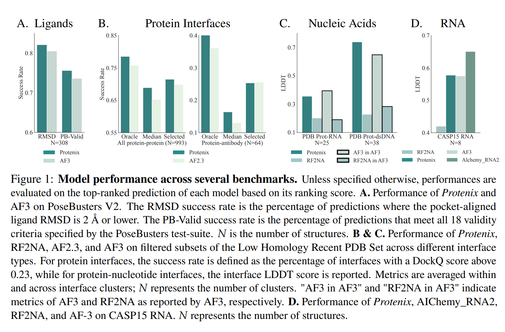

# Introduction
表现更好  

包括对alphafolder3的复现

完全开源

# Results
## Overview
模型训练数据截至2021.9.30

## Ligands
配体

## Protenis
蛋白质

## <mark>Nucleic Acids<mark>
RNA/DNA
对核酸结构预测不使用MSA?:<mark>We do not use MSA for nucleic chains.